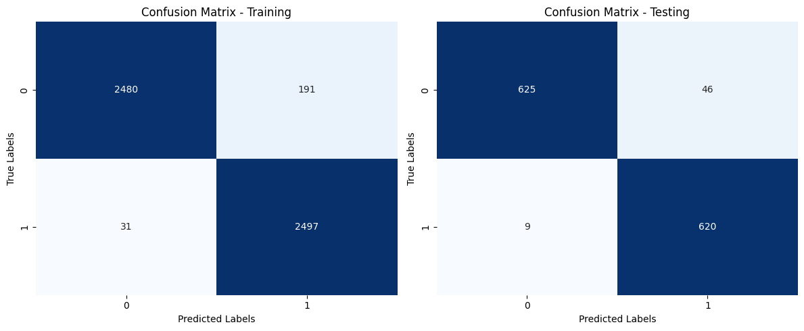
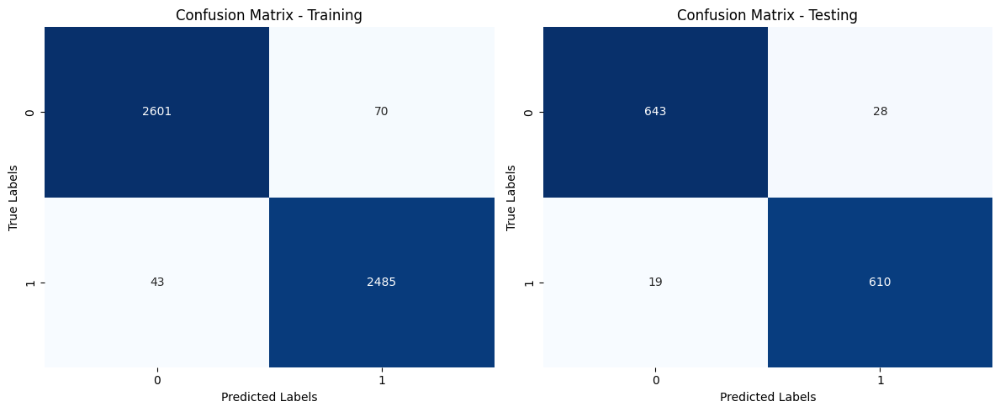

# Supervised ML: Mushroom classification.

## Project Overwiew

This project aims to accurately classify mushrooms as either poisonous or non-poisonous using supervised machine learning techniques. I have leveraged decision tree and random forest classifiers on our specialized mushroom dataset to achieve this.

The dataset used in this project, `train.csv`, contains 6,498 entries across 8 different columns, providing a comprehensive set of features for model training and testing. The most effective model determined through testing on this dataset will subsequently be applied to `test.csv` for final evaluation.

## Model Testing Procedure 

I have followed these steps to execute the models:

1. **Data Splitting**: Separate the provided data into distinct training and testing datasets.
2. **Column Identification**: Detect and categorize the numerical and categorical columns within the data.
3. **Pipeline Creation**: Establish separate pipelines for preprocessing numerical and categorical data.
4. **Preprocessor Combination**: Merge the numerical and categorical pipelines into a unified data preprocessor.
5. **Model Integration**: Formulate a comprehensive pipeline incorporating both data preprocessing and the Decision Tree classifier.
6. **Model Training**: Apply the training dataset to the integrated pipeline to train the Decision Tree model.
7. **Parameter Optimization**: Utilize RandomizedSearchCV with a predefined parameter grid to optimize model settings.
8. **Prediction Execution**: Utilize the trained model to predict mushroom classifications on both training and testing sets.
9. **Performance Evaluation**: Compute and display the accuracy, precision, and recall metrics for the predictions on both datasets.
10. **Confusion Matrix Generation**: Produce and analyze confusion matrices for predictions made on both the training and testing datasets.

By adhering to these steps, the project aims to establish a robust model capable of accurately classifying mushrooms, thereby assisting in distinguishing between poisonous and non-poisonous varieties.

## Project's Folder Structure

This project is organized into two directories, each serving a specific purpose. Below is the structure and description of these directories:

- `/data`: This directory contains all CSV tables which have been used for the project.

- `/plots`: This directory houses all the plots generated as part of this project.

Additionally, all model calculations, including data preprocessing, model training, parameter tuning, and evaluation metrics, are comprehensively documented in the main.ipynb Jupyter notebook. 

## Analysis

After running the models, you can find the accuracy, precision, recall, and F1-score for each model in the terminal output. These metrics are crucial for comparing the performance of the Decision Tree and Random Forest classifiers. Additionally, the generated plots in the /plots directory can help visualize the performance differences between the models.

### Decision Tree

After extensive parameter tuning using RandomizedSearchCV with 280 candidates and a total of 1400 fits, the optimal settings for our Decision Tree model were identified as follows:

* Imputation Strategy for Numerical Features: Mean
* Splitter: Random
* Minimum Samples per Leaf: 3
* Maximum Depth of Tree: 11
* Criterion: Gini

These parameters were determined after fitting the model across 5 folds for each of the 280 candidate settings.

#### Model Performance

The performance of the Decision Tree model, with the parameters specified above, yielded the following metrics:

Training Data Accuracy: 95.73%
Test Data Accuracy: 95.77%
Training Data Precision: 92.89%
Test Data Precision: 93.09%
Training Data Recall: 98.77%

#### Decisoon Tree Matrix

* True Negatives (TN): 625 - The model correctly predicted the non-poisonous mushrooms.
* False Positives (FP): 46 - The model incorrectly predicted non-poisonous mushrooms as poisonous.
* False Negatives (FN): 9 - The model incorrectly predicted poisonous mushrooms as non-poisonous.
* True Positives (TP): 620 - The model correctly predicted the poisonous mushrooms.

### Random Forest 

The best parameters identified for the Random Forest model were as follows:

* Imputation Strategy for Numerical Features: Mean
* Number of Estimators: 100
* Minimum Samples per Split: 10
* Minimum Samples per Leaf: 1
* Maximum Depth of Trees: None (unlimited)
* Bootstrap: True
These settings were finalized after conducting a comprehensive evaluation over the specified parameter space.

#### Model Performance Metrics

The performance of the Random Forest model with the optimized parameters is detailed below:

Training Data Accuracy: 97.83%
Test Data Accuracy: 96.38%
Training Data Precision: 97.26%
Test Data Precision: 95.61%
Training Data Recall: 98.30%

#### Confusion Matrix 

* True Negatives (TN): 643 - The model correctly predicted the non-poisonous mushrooms.
* False Positives (FP): 28 - The model incorrectly predicted non-poisonous mushrooms as poisonous.
* False Negatives (FN): 19 - The model incorrectly predicted poisonous mushrooms as non-poisonous.
* True Positives (TP): 610 - The model correctly predicted the poisonous mushrooms.

## Conclusion

In scenarios like mushroom classification, false negatives (mistaking poisonous mushrooms for non-poisonous) are generally more dangerous than false positives. From this perspective, the Decision Tree has an advantage with lower false negatives. However, the Random Forest model demonstrates better overall accuracy and a balanced error distribution (fewer false positives and a reasonable number of false negatives).

Since our primary concern is to minimize the risk of classifying a poisonous mushroom as non-poisonous, the Decision Tree might be slightly more preferable due to its lower false negative rate. 

